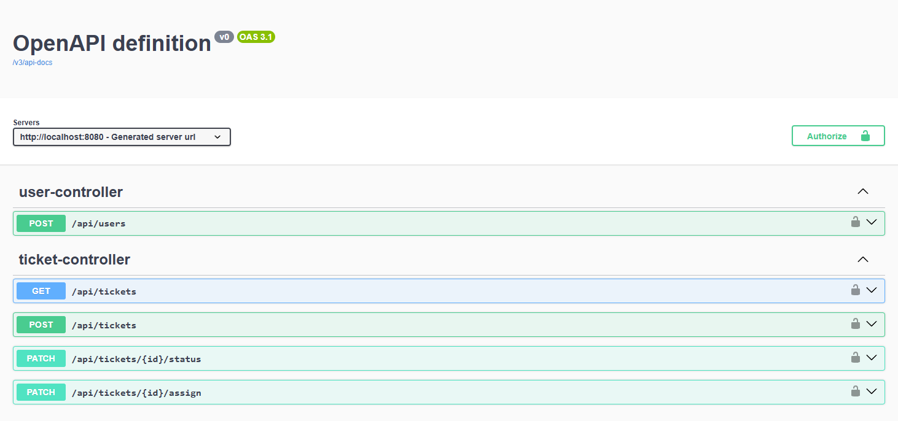
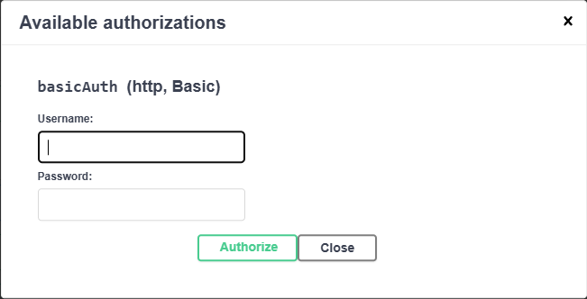
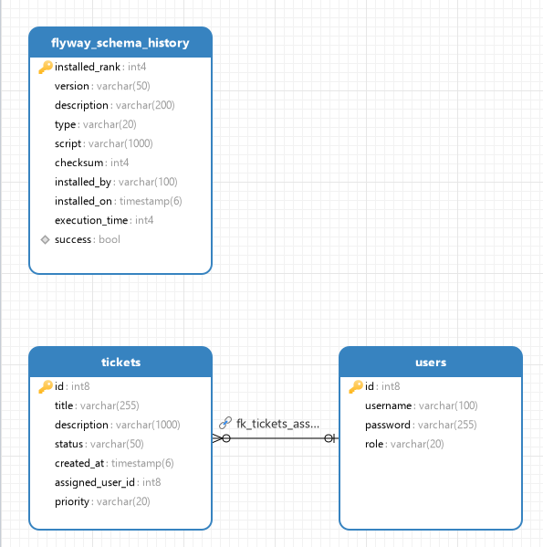
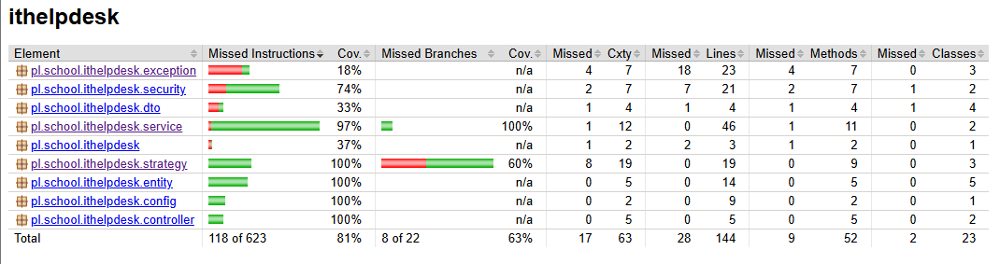
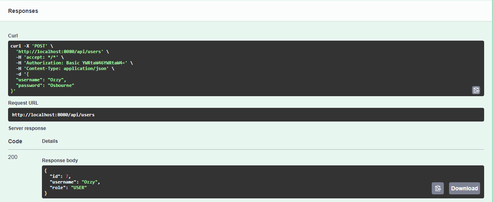
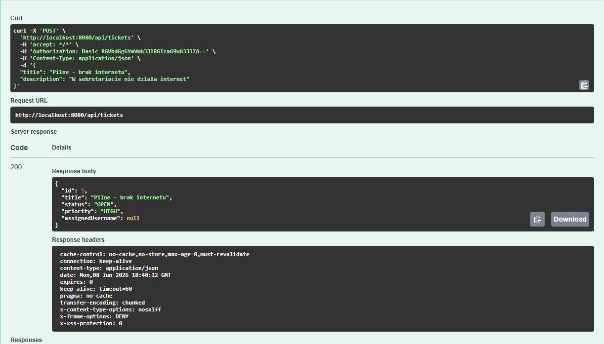
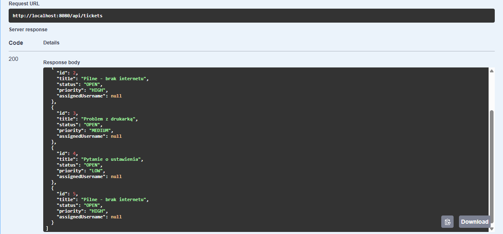
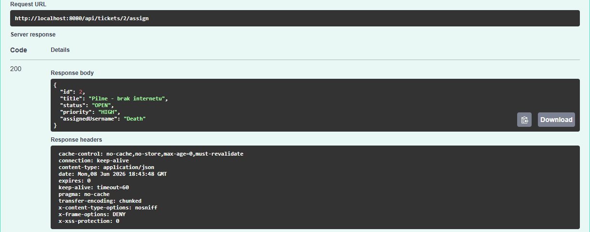
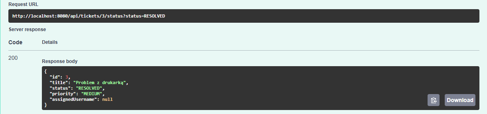

# School IT Helpdesk

Aplikacja backendowa typu **Helpdesk IT dla szkoły**. System umożliwia tworzenie zgłoszeń technicznych, zarządzanie ich statusem, automatyczne nadawanie priorytetu, przypisywanie zgłoszeń do użytkowników oraz obsługę ról `USER` i `ADMIN`.

Projekt został przygotowany jako aplikacja Java/Spring Boot zgodnie z wymaganiami przedmiotu.

---

## Spis treści

* [Technologie](#technologie)
* [Główne funkcjonalności](#główne-funkcjonalności)
* [Role i uprawnienia](#role-i-uprawnienia)
* [Uruchomienie projektu](#uruchomienie-projektu)
* [Swagger UI](#swagger-ui)
* [Endpointy API](#endpointy-api)
* [Statusy i priorytety zgłoszeń](#statusy-i-priorytety-zgłoszeń)
* [Strategy Pattern i polimorfizm](#strategy-pattern-i-polimorfizm)
* [Obsługa błędów](#obsługa-błędów)
* [Baza danych i migracje](#baza-danych-i-migracje)
* [Diagram ERD](#diagram-erd)
* [Testy i pokrycie kodu](#testy-i-pokrycie-kodu)
* [Struktura projektu](#struktura-projektu)
* [Autor](#autor)

---

## Technologie

Projekt wykorzystuje:

* Java 17
* Spring Boot 3.5.14
* Maven
* Spring Web
* Spring Security
* Spring Data JPA
* Hibernate
* PostgreSQL
* Flyway
* Docker / Docker Compose
* Swagger / OpenAPI
* JUnit 5
* Mockito
* JaCoCo
* Lombok

---

## Główne funkcjonalności

Aplikacja umożliwia:

* tworzenie użytkowników,
* haszowanie haseł przy użyciu BCrypt,
* obsługę ról `USER` i `ADMIN`,
* logowanie przez HTTP Basic Auth,
* tworzenie zgłoszeń IT,
* automatyczne nadawanie priorytetu zgłoszeniom,
* pobieranie listy zgłoszeń,
* zmianę statusu zgłoszenia,
* przypisywanie zgłoszenia do użytkownika,
* walidację danych wejściowych,
* globalną obsługę błędów,
* dokumentację API w Swagger UI,
* zarządzanie schematem bazy danych przez Flyway,
* testy jednostkowe z raportem pokrycia JaCoCo.

---

## Role i uprawnienia

| Rola    | Uprawnienia                                                                       |
| ------- | --------------------------------------------------------------------------------- |
| `USER`  | tworzenie zgłoszeń, podgląd zgłoszeń                                              |
| `ADMIN` | podgląd zgłoszeń, zmiana statusu zgłoszeń, przypisywanie zgłoszeń do użytkowników |

Zasady dostępu zostały skonfigurowane w Spring Security.

---

## Uruchomienie projektu

### 1. Uruchomienie bazy danych PostgreSQL

W głównym folderze projektu uruchom:

```bash
docker compose up -d
```

Konfiguracja bazy danych:

```text
database: ithelpdesk
user: admin
password: admin
port: 5432
container: ithelpdesk-db
```

### 2. Uruchomienie aplikacji

Aplikację można uruchomić w IntelliJ IDEA przez klasę:

```text
IthelpdeskApplication
```

Domyślny adres aplikacji:

```text
http://localhost:8080
```

### 3. Zatrzymanie bazy danych

```bash
docker compose down
```

---

## Swagger UI

Dokumentacja API jest dostępna pod adresem:

```text
http://localhost:8080/swagger-ui/index.html
```

Swagger obsługuje autoryzację przez Basic Auth.





---

## Endpointy API

### Użytkownicy

| Metoda | Endpoint     | Opis                   | Dostęp    |
| ------ | ------------ | ---------------------- | --------- |
| `POST` | `/api/users` | utworzenie użytkownika | publiczny |

Przykładowe body:

```json
{
  "username": "jan",
  "password": "test123"
}
```

Przykładowa odpowiedź:

```json
{
  "id": 1,
  "username": "jan",
  "role": "USER"
}
```

Hasło nie jest zwracane w odpowiedzi API.

---

### Zgłoszenia

| Metoda  | Endpoint                                   | Opis                                  | Dostęp          |
| ------- | ------------------------------------------ | ------------------------------------- | --------------- |
| `POST`  | `/api/tickets`                             | utworzenie zgłoszenia                 | `USER`          |
| `GET`   | `/api/tickets`                             | pobranie listy zgłoszeń               | `USER`, `ADMIN` |
| `PATCH` | `/api/tickets/{id}/status?status=RESOLVED` | zmiana statusu zgłoszenia             | `ADMIN`         |
| `PATCH` | `/api/tickets/{id}/assign`                 | przypisanie zgłoszenia do użytkownika | `ADMIN`         |

Przykładowe body dla utworzenia zgłoszenia:

```json
{
  "title": "Pilne - brak internetu",
  "description": "W sekretariacie nie działa internet"
}
```

Przykładowa odpowiedź:

```json
{
  "id": 1,
  "title": "Pilne - brak internetu",
  "status": "OPEN",
  "priority": "HIGH",
  "assignedUsername": null
}
```

Przykład przypisania zgłoszenia do użytkownika:

```json
{
  "userId": 5
}
```

Przykładowa odpowiedź:

```json
{
  "id": 1,
  "title": "Nie działa drukarka",
  "status": "IN_PROGRESS",
  "priority": "MEDIUM",
  "assignedUsername": "Death"
}
```

---

## Statusy i priorytety zgłoszeń

### Statusy zgłoszeń

Zgłoszenie może mieć jeden z poniższych statusów:

* `OPEN`
* `IN_PROGRESS`
* `RESOLVED`
* `CLOSED`

### Priorytety zgłoszeń

Priorytet zgłoszenia jest ustawiany automatycznie przy tworzeniu zgłoszenia.

Dostępne priorytety:

* `LOW`
* `MEDIUM`
* `HIGH`

Przykładowe zasady:

| Priorytet | Przykładowe słowa kluczowe                               |
| --------- | -------------------------------------------------------- |
| `HIGH`    | pilne, awaria, brak internetu, nie działa, nie uruchamia |
| `MEDIUM`  | drukarka, komputer, projektor, Teams, konto              |
| `LOW`     | pozostałe zgłoszenia                                     |

---

## Strategy Pattern i polimorfizm

W projekcie zastosowano wzorzec projektowy **Strategy Pattern** do automatycznego określania priorytetu zgłoszenia.

Interfejs strategii:

```text
TicketPriorityStrategy
```

Implementacje:

```text
HighPriorityStrategy
MediumPriorityStrategy
LowPriorityStrategy
```

Każda strategia implementuje ten sam interfejs, ale posiada własną logikę sprawdzania zgłoszenia. Dzięki temu projekt wykorzystuje **polimorfizm**.

Przykład działania:

* `HighPriorityStrategy` sprawdza, czy zgłoszenie zawiera pilne słowa, np. `pilne`, `awaria`, `brak internetu`,
* `MediumPriorityStrategy` sprawdza, czy zgłoszenie dotyczy np. drukarki, komputera, projektora lub konta,
* `LowPriorityStrategy` działa jako domyślna strategia, gdy żadna inna nie pasuje.

Takie rozwiązanie pozwala łatwo dodać kolejną strategię bez rozbudowywania klasy serwisowej wieloma instrukcjami `if`.

---

## Obsługa błędów

Projekt posiada globalną obsługę błędów przy pomocy:

```text
@RestControllerAdvice
```

Obsługiwane są między innymi:

* brak zgłoszenia,
* brak użytkownika,
* błędy walidacji danych wejściowych.

Przykład odpowiedzi dla nieistniejącego zgłoszenia:

```json
{
  "timestamp": "2026-06-05T20:34:33",
  "status": 404,
  "error": "Not Found",
  "message": "Ticket with id 999 was not found",
  "path": "/api/tickets/999/status"
}
```

Przykład odpowiedzi dla błędnej walidacji:

```json
{
  "title": "Title cannot be blank",
  "description": "Description cannot be blank"
}
```

---

## Baza danych i migracje

Projekt korzysta z bazy danych **PostgreSQL** oraz migracji **Flyway**.

Migracje:

```text
V1__init_database.sql
V2__create_ticket_table.sql
V3__add_assigned_user_to_tickets.sql
V4__add_priority_to_tickets.sql
```

Główne tabele:

* `users`
* `tickets`

Relacja:

```text
tickets.assigned_user_id -> users.id
```

---

## Diagram ERD

Diagram ERD przedstawia relację między tabelami `users` i `tickets`.



---

## Testy i pokrycie kodu

Projekt zawiera testy jednostkowe dla:

* serwisów,
* kontrolerów,
* strategii priorytetów,
* uruchomienia kontekstu aplikacji.

Przetestowane zostały między innymi:

* tworzenie użytkownika,
* kodowanie hasła,
* tworzenie zgłoszenia,
* automatyczne ustawianie priorytetu,
* zmiana statusu zgłoszenia,
* przypisanie zgłoszenia do użytkownika,
* obsługa wyjątków,
* działanie strategii `HIGH`, `MEDIUM`, `LOW`.

Raport JaCoCo znajduje się po wygenerowaniu w:

```text
target/site/jacoco/index.html
```

Aktualne pokrycie testami:

```text
81%
```



---

## Struktura projektu

Przykładowa struktura pakietów:

```text
src/main/java/pl/school/ithelpdesk
├── config
├── controller
├── dto
├── entity
├── exception
├── repository
├── security
├── service
└── strategy
```

Opis pakietów:

| Pakiet       | Opis                                     |
| ------------ | ---------------------------------------- |
| `config`     | konfiguracja OpenAPI                     |
| `controller` | endpointy REST                           |
| `dto`        | obiekty żądań i odpowiedzi               |
| `entity`     | encje JPA                                |
| `exception`  | własne wyjątki i globalna obsługa błędów |
| `repository` | repozytoria Spring Data JPA              |
| `security`   | konfiguracja Spring Security i logowanie |
| `service`    | logika biznesowa                         |
| `strategy`   | wzorzec Strategy Pattern dla priorytetów |

---

## Przykładowe screeny

### Swagger UI


### Tworzenie użytkownika



### Tworzenie zgłoszenia



### Lista zgłoszeń



### Przypisanie zgłoszenia



### Zmiana statusu zgłoszenia



### Raport JaCoCo


---

## Autor

Mateusz Kobylarczyk
